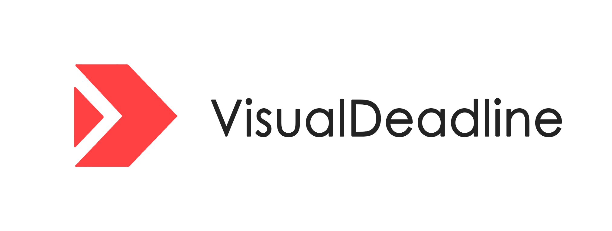

<p align="center">
  
</p>

<div align="center">

# Visual Deadline

### Visualize pressure, not just tasks.

A pressure-aware, visualization-driven life operating system for deadlines, priorities, relationships, achievements, and AI-assisted self-management.

[](./LICENSE)
[](https://react.dev/)
[](https://www.typescriptlang.org/)
[](https://vite.dev/)
[](./SECURITY.md)
[](./ROADMAP.md)

</div>

---

## What is VD?

**Visual Deadline (VD)** is not a traditional todo list. It is a **life operating system** that makes invisible pressure visible.

Most task apps ask: “What do you need to do?” VD asks a deeper question:

> **What is applying pressure to your life, where is that pressure coming from, and what should move first?**

VD combines visualized deadlines, pressure calculation, task importance, life structure mapping, social relationship graphs, achievement loops, and future AI assistance into a single shell-based information architecture.

It is designed for people whose work and life cannot be represented as a flat checklist: students, researchers, builders, founders, creators, operators, and anyone managing many overlapping life systems.

---

## Philosophy

<div align="center">

### “Visualize pressure, not just tasks.”

</div>

Tasks are not equal. A tiny task due tomorrow can create more pressure than a large project due next month. A neglected relationship can drain more mental energy than an unfinished assignment. A “low priority” administrative task can become dangerous when it silently approaches a deadline.

VD treats personal productivity as a **dynamic pressure field**:

- deadlines generate urgency;
- importance changes the cost of delay;
- recovery reduces load;
- relationships create social obligations;
- achievements reinforce momentum;
- maps reveal structure that lists hide.

The long-term goal is to become a local-first, extensible system for understanding life pressure across work, study, health, finance, relationships, and personal growth.

---

## Why VD Exists

Traditional todo apps often fail when life becomes complex:

| Traditional todo lists | Visual Deadline |
| --- | --- |
| Flat task rows | Spatial pressure fields |
| Manual priority labels | Calculated urgency × importance |
| Completion-focused | Pressure-aware and recovery-aware |
| Isolated tasks | Life domains, social graphs, logs, achievements |
| Productivity as throughput | Life management as structure, clarity, and momentum |

VD exists because people do not only need more reminders. They need a way to **see the shape of their obligations** before those obligations become anxiety.

---

## Core Features

### Pressure Engine

- Calculates active task pressure from urgency and importance.
- Supports subjective pressure calibration so the model adapts to the user.
- Separates recovery and entertainment activities from pressure-generating tasks.
- Highlights overload and burnout-risk states when raw pressure exceeds healthy ranges.

### Visual Deadline System

- Turns task timing into a visual pressure map.
- Makes near, important, and neglected items visually harder to ignore.
- Helps users decide what to move next instead of simply sorting a list.

### Life Map

- Maps life domains such as Academic, Research, Fitness, Finance, Social, Content, and Health.
- Uses a graph-centered model with “me” at the center.
- Supports local editing for personal structure visualization.

### Social Graph

- Models social relationships as editable graph nodes and directed connections.
- Captures social context such as relationship type, familiarity, trust, emotional closeness, influence, and interaction frequency.
- Creates the foundation for future social pressure and relationship maintenance systems.

### Logs, Archive, and Review

- Tracks completed and abandoned activities.
- Supports review notes for archived items.
- Turns past actions into a personal operating history instead of a forgotten task graveyard.

### Achievement System

- Rewards first-use milestones and meaningful behavioral progress.
- Encourages healthy pressure reduction, completion, pruning, and recovery.
- Provides early scaffolding for future progression and identity systems.

### Local-First Data Safety

- Stores user data in the browser by default.
- Supports structured backup export and import.
- Uses schema-aware backup envelopes for future migration to IndexedDB, SQLite, encrypted sync, or account systems.

### Future AI-Assisted Life Management

VD is designed to eventually support AI agents that can:

- summarize pressure sources;
- recommend next actions;
- detect overloaded life domains;
- generate weekly reviews;
- identify neglected relationships;
- simulate schedule and deadline outcomes.

---

## Screenshots

> Replace these placeholders with polished captures as the product evolves.

| Daily Control Center | Pressure Calibration | Life Map |
| --- | --- | --- |
|  |  |  |

| Social Graph | Archive & Review | Profile Shell |
| --- | --- | --- |
|  |  |  |

## Demo GIF Placeholders

| Demo | Purpose |
| --- | --- |
| `./gifs/pressure-rising-demo.gif` | Show deadline pressure increasing over time. |
| `./gifs/life-map-navigation.gif` | Show shell navigation between Home, Map, Social, Logs, and Me. |
| `./gifs/social-pressure-graph.gif` | Show relationship nodes becoming visually active based on interaction recency. |
| `./gifs/ai-weekly-review.gif` | Show a future AI assistant summarizing pressure and next moves. |

More demo ideas are documented in [`docs/DEMO_GIF_IDEAS.md`](./docs/DEMO_GIF_IDEAS.md).

---

## Architecture Overview

VD is currently a Vite + React + TypeScript application with a local-first browser data model.

```text
Visual Deadline
├── src/                    # Product source code
│   ├── App.tsx             # Shell, views, state orchestration
│   ├── main.tsx            # React entrypoint
│   └── styles.css          # Visual system and responsive UI
├── docs/                   # Product, growth, and branding documentation
├── screenshots/            # Static README and release screenshots
├── gifs/                   # Demo GIFs and launch assets
├── assets/                 # Brand assets, diagrams, icons, media
├── plugins/                # Future plugin packages and examples
├── shell/                  # Future shell information architecture experiments
├── ai/                     # Future AI prompts, agents, evals, and workflows
└── roadmap/                # Detailed roadmap artifacts and research notes
```

The architecture is intentionally organized around future expansion:

- **Product shell first**: VD is not a single widget; it is a navigable life system.
- **Local-first persistence**: user trust starts with data that remains under user control.
- **Graph-ready domains**: life, social, task, and pressure systems can eventually converge into a life graph.
- **Plugin-ready boundaries**: future integrations can attach without rewriting the core experience.

A fuller structure proposal is available in [`docs/REPOSITORY_STRUCTURE.md`](./docs/REPOSITORY_STRUCTURE.md).

---

## Installation

### Requirements

- Node.js 18+
- npm

### Clone and install

```bash
git clone https://github.com/<your-org-or-username>/Visualized-Deadline.git
cd Visualized-Deadline
npm install
```

---

## Quick Start

```bash
npm run dev
```

Vite will print a local development URL, usually:

```text
http://localhost:5173
```

Build the production bundle:

```bash
npm run build
```

Preview the production build locally:

```bash
npm run preview
```

---

## Current Technical Stack

- React
- TypeScript
- Vite
- Tailwind CSS
- localStorage
- `@xyflow/react` for graph interaction foundations

---

## Pressure Model

VD does not treat subjective pressure as a permanent background value. During onboarding or recalibration, the user’s subjective pressure represents how stressful the current active task set feels.

```text
referencePressure = user-entered subjective pressure
referenceTaskLoad = sum of active task load
pressureRatio = referencePressure / referenceTaskLoad
```

Daily estimate:

```text
currentPressure = currentTaskLoad × pressureRatio - recoveryRelief
```

Where:

- `currentTaskLoad` comes from `urgencyWeight × importanceWeight`.
- `pressureRatio` is the user-specific mapping from task load to felt pressure.
- `recoveryRelief` comes from recovery or entertainment activities.
- If calibration has no active task load, VD uses a safe default to avoid division by zero.
- If raw pressure exceeds 100, VD can show a `100+` burnout-risk state.

Pressure bands:

| Range | State |
| --- | --- |
| 0–30 | Stable |
| 31–60 | Manageable |
| 61–80 | High pressure |
| 81–100 | Overloaded |
| >100 | Burnout risk |

---

## Local Storage Keys

<details>
<summary>View current browser storage keys</summary>

- `visualized-deadline.tasks`: tasks and activity items.
- `visualized-deadline.baselinePressure`: legacy compatibility key.
- `visualized-deadline.achievements`: unlocked achievements.
- `visualized-deadline.profile`: local profile data and avatar data URL.
- `visualized-deadline.onboardingComplete`: onboarding completion state.
- `visualized-deadline.pressureCalibration`: pressure calibration snapshot.
- `visualized-deadline.lifeMap.nodes` / `visualized-deadline.lifeMap.edges`: life map graph data.
- `visualized-deadline.social.nodes` / `visualized-deadline.social.edges`: social graph data.

</details>

---

## Roadmap

VD’s roadmap is ambitious, but staged. The project is moving from a local-first visual deadline prototype toward a productized life operating system.

- **v0.x Foundations**: stabilize shell, data safety, pressure model, graph views, onboarding, export/import.
- **v1.0 Productization**: polished UX, reliable releases, public demo assets, accessibility, responsive layouts.
- **AI Integration**: pressure summaries, weekly reviews, next-action suggestions, overloaded-domain detection.
- **Plugin Ecosystem**: integration APIs, plugin manifests, community examples, safe permission model.
- **Social Systems**: relationship health indicators, interaction reminders, social pressure mapping.
- **Life Graph**: unified graph of tasks, domains, people, goals, achievements, and time.
- **World-Model Ideas**: simulations that show how decisions affect future pressure.

Read the complete roadmap in [`ROADMAP.md`](./ROADMAP.md).

---

## Contributing

VD welcomes contributors who care about product design, visualization, local-first software, AI-assisted tools, and emotionally intelligent productivity systems.

Good first contribution areas:

- improve onboarding copy;
- refine pressure visualization;
- design screenshot and GIF assets;
- improve accessibility;
- add tests around data migration;
- propose plugin API boundaries;
- document user workflows.

Please read [`CONTRIBUTING.md`](./CONTRIBUTING.md) before opening a pull request.

---

## Security and Privacy

VD is designed around a local-first trust model. The current app stores personal data in the user’s browser and provides backup/export foundations for future portability.

If you discover a vulnerability or privacy issue, please follow [`SECURITY.md`](./SECURITY.md).

---

## Branding and Growth

- Branding language: [`docs/BRANDING.md`](./docs/BRANDING.md)
- Open-source growth strategy: [`docs/GROWTH_STRATEGY.md`](./docs/GROWTH_STRATEGY.md)
- Demo GIF ideas: [`docs/DEMO_GIF_IDEAS.md`](./docs/DEMO_GIF_IDEAS.md)
- Repository structure proposal: [`docs/REPOSITORY_STRUCTURE.md`](./docs/REPOSITORY_STRUCTURE.md)

---

## Acknowledgements

VD is inspired by modern open-source product craft and developer experience from projects and ecosystems such as MineContext, Next.js, Supabase, shadcn/ui, OpenInterpreter, and LangChain.

The project also draws from ideas in time management, cognitive load theory, personal knowledge management, graph visualization, local-first software, and human-centered AI.

---

## License

Visual Deadline is licensed under the [Apache License 2.0](./LICENSE).
